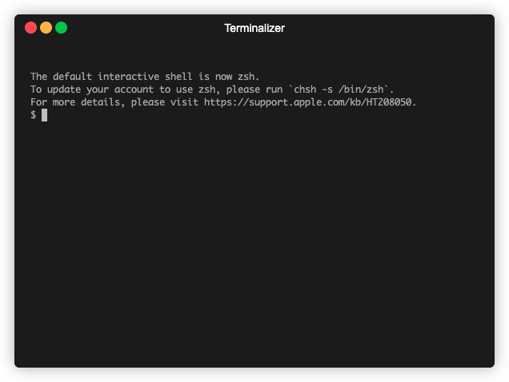

[](https://github.com/ComputationalPhysiology/mps/actions/workflows/main.yml)
[](https://badge.fury.io/py/cardiac-mps)
[](https://codecov.io/gh/ComputationalPhysiology/mps)
[](https://github.com/ComputationalPhysiology/mps/actions/workflows/github-pages.yml)
[](https://github.com/psf/black)
[](https://www.gnu.org/licenses/lgpl-2.1)


# MPS data

This repository contains the software for reading and analyzing MPS data.
The analysis scripts are heavily based on [ap_features](https://github.com/ComputationalPhysiology/ap_features) which is a package for computing features of action potential traces.

## Installation

To install the package you can clone the repository and install from source
```
cd mps
python -m pip install "."
```
or install directly from github
```
python -m pip install git+https://github.com/finsberg/mps.git
```
Developers should install some extra dependencies including a pre-commit hook.
Execute `make dev` or consult the `dev` target in the [Makefile](Makefile).

## Usage


### CLI
Once installed you can use the command line script from the terminal.

In the following demo I have the `mps` packaged installed in a [virtual environment](https://realpython.com/python-virtual-environments-a-primer/) which is first activated. Then it shows how to run the analysis script on a single file.



### Python API
The most useful features of this package it to read imaging data which can be done as follow

```python
import mps
# Object containing the frames, time stamps and metadata
data = mps.MPS("file.nd2")
```
To convert the data into a trace you can do
```python
import ap_features as apf

# Compute the average over all pixels
y = mps.average.get_average_all(data.frames)
# Convert it to an apf.Beats and compute features
# using the ap_features package
trace = apf.Beats(y=y, t=data.time_stamps, pacing=data.pacing)
```


## Pre-built binaries

You can also get pre-built binaries for Windows, MaxOSX and Linux in case you don't want to install anything.

- [Windows binaries](https://github.com/finsberg/mps/suites/4925484003/artifacts/142197690)
- [MacOSX binaries](https://github.com/finsberg/mps/suites/4925484003/artifacts/142197688)
- [Linux binaries](https://github.com/finsberg/mps/suites/4925484003/artifacts/142197689)


The binary is called `mps` (with a `.exe` extension if you are running on Windows)
Note that the binaries ships with python, so to don't even need to install python to run the binaries.
Note, however that the size of the binaries are large.
In order to run the binaries you just need to download the zip file, and extract the executable to a location that your operating system can find it.
For example, if you are on windows you can copy this file to `C:\Windows\System32` directory, and if on linux you could copy it to `usr/bin`.
This will, however require admin access. If you don't have admin access you can put it in a new folder and add that folder to your `PATH` environment variable.
On unix you also need to make the file executable:
```
chmod +x mps
```
You can also run the file from its current location.

### Usage

If you execute the binary without any arguments, i.e

on Unix
```
./mps
```
or on Windows
```
.\mps.exe
```

you should get the following output

```
Usage: __main__.py [OPTIONS] COMMAND [ARGS]...

Options:
  --version                       Show version
  --license                       Show license
  --install-completion [bash|zsh|fish|powershell|pwsh]
                                  Install completion for the specified shell.
  --show-completion [bash|zsh|fish|powershell|pwsh]
                                  Show completion for the specified shell, to
                                  copy it or customize the installation.

  --help                          Show this message and exit.

Commands:
  analyze       Analyze flourecense data
  mps2mp4       Create movie of data file
  phase-plot    Create movie of data file
  split-pacing  Run script on a folder with files and this will copy the...
  summary       Create a summary pdf of all files in the a directory.
```

This shows the available commands that you can use with the script.
For example if yoo have an mps data file called `file.nd2` then running

(Unix)
```
./mps analyze file.nd2
```

(Windows)
```
.\mps.exe analyze file.nd2
```

will analyze that file. You can also type

```
.\mps.exe analyze --help
```
to see all the available options.


## Known issues

1. The `prevalence` script is not yet working

2. To use the `mps2mp4` script you also need to install `ffmpeg` separately


## Integration with motion tracking

If you also have installed the [motion tracking script](https://github.com/ComputationalPhysiology/mps_motion_tracking) should should be able to also run

```
python -m mps motion file.nd2
```
in order to run the motion analysis.


## Documentation

If you run

```
make docs
```

you will generate documentation that can be viewed in the browser.
Here you should be able to read about how the program is working.

## If you find a bug?

If the scripts behave in an unexpected manner, or you encounter any bugs, please submit this as an issue.
Click on the issue tab (on the top of this page). Write a descriptive title and paste in the output from your console.


## Contact

This software is developed by Henrik Finsberg at Simula Research Laboratory.
If you need to get in contact, please send me an email at [henriknf@simula.no](mailto:henriknf@simula.no).

## License

LGPLv2
